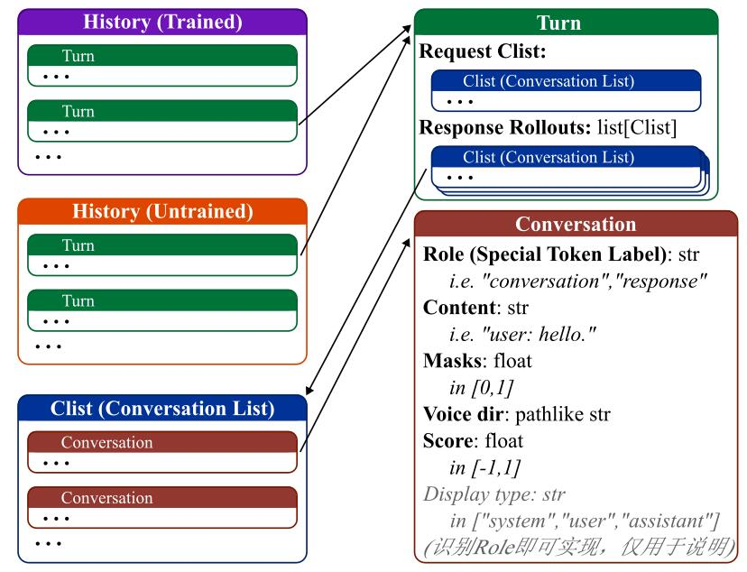

## RNN 历史信息管理

由于RWKV是一个工作在**RNN模式**下的语言模型，所以，其历史信息的管理相比于Transformer模型复杂。相对的，RWKV可以实现更连贯的在线学习。
为了实现这一点，`RWKV-Development-Tools`针对在线学习任务提供了一种历史信息容器，其结构如下：

### 概述
- `Conversation` 是单条消息的对话容器
    - `Role` 字段决定每条消息的 `special token`。
    - `Content` 字段决定每条消息的内容。
    - `Mask` 字段决定每条消息的掩码，服务于训练。
    - `Score` 字段记录每条消息的分数，服务于强化学习。
    - `Voice` 字段用于记录对话中涉及到每一段语音的路径。*高级特性*
- `Clist` 是 `Conversation` 的容器，用来存储具有某种意义的一组对话，是`list`的重载。
- `Turn` 容纳了智能体一次交互过程中的对话历史，包括其接收的请求`Clist`，以及多次重新生成的响应`Clist`。
    - `Request Clist` 是请求体，其中可能包含使用者的消息，或者其他智能体在其未进行回复时的对话内容。
    - `Response Rollouts` 是响应列表，包含了每次重新生成的`Clist`，`Clist`中可能包含了智能体的回复，以及智能体与系统交互时系统的回复。`Response Rollouts[-1]` 是被选定的历史消息。
- `History` 是 `Turn` 的容器，储存多轮交互。其中，`Untrained History` 是未训练的历史消息，`Trained History` 是训练好的历史消息。当自动训练结束后, `Untrained History[:-1]` 中的消息会被转移到 `Trained History` 中。

### Q&A
- **Q:** `Conversation` 中的 `Role` 字段好奇怪，它似乎与 `OpenAI API` 中的 `Role` 字段意义不同，与 `OpenAI API` 中的 `Role` 字段意义相同的概念被转移到了 `Display type` 字段中，为什么？
- **A:** 因为 `RWKV-Development-Tools` 的目的不是进行推理服务，而是面向希望对模型进行训练（尤其需要以高自由度定义数据）的用户。所以，`Special Token` 的管理是不可避免的。而 `Special Token` 的类型远比 `User` 和 `Assistant` 多。

- **Q:** 好像没有支持图像模态？
- **A:** 确实。未来将会统一加入图像和视频模态，届时容器的结构会有所调整。